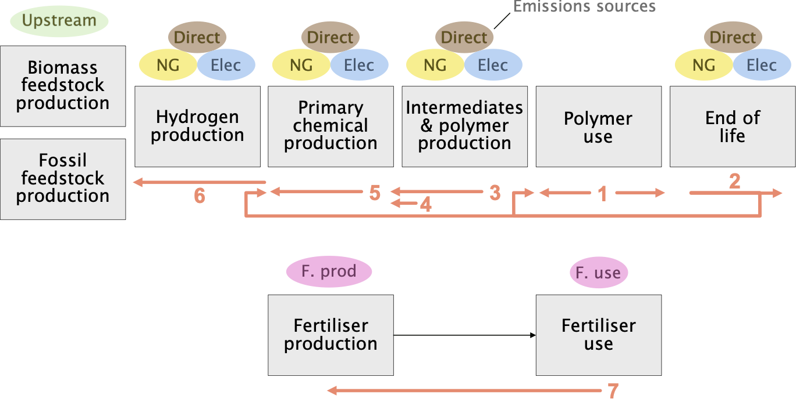

# Model logic {#sec-model-logic}

::: {#fig-logic-steps}

Model structure and logic steps
:::

The processes described in @sec-system-definitions need to be deployed in suitable combinations to meet demand within the available supply and/or capacity constraints. Generally, there are multiple ways that this could plausibly happen, especially when there are multiple technologies available to produce the same chemical. The model "logic" sets out the mass-flow solutions corresponding to particular choices of model parameters (such as capacities or feedstock shares). This builds up the final pattern of process operation and mass flows step by step, as illustrated in @fig-logic-steps and described below:

1. Determine demand and end-of-life flows of polymers from the stock model (see [@sec-product-demand]).

2. Allocate end-of-life polymers to mechanical recycling or chemical recycling based on the recycling rate parameters, with the residual allocated to final treatment options (see [@sec-recycling;@sec-final-treatment]).

3. Determine required primary chemicals to satisfy the remaining demand for polymers that is not already covered by mechanical recycling. Mechanical recycling is assumed to perfectly substitute virgin polymer production. 

4. Add in additional demand for primary chemicals to non-polymer applications (see [@sec-extra-demand]).

5. Produce primary chemicals in turn using preferred routes first, until their capacity has been exhausted. First, ethylene demand is satisfied:

   - Ethylene is produced from biomass via ethyl alcohol, where capacity is available (see [@sec-bioethanol-capacity]).
   - Ethylene is produced from methyl alcohol (methanol), where MTO capacity is available (see [@sec-ethylene-methanol-capacity]).
   - Any residual demand for ethylene is produced from steam cracking of fossil naphtha and ethane (see [@sec-olefins-paraffins-mix]).

   These processes produce benzene, toluene, and xylenes (BTX) as by-products; if further demand for BTX remains, then it is satisfied as follows:
   
   - Demand for xylenes is satisfied from methyl alcohol, where MTA capacity is available (see [@sec-xylenes-methyl-alcohol-capacity]).
   - Excess toluene production is converted to xylenes by disproportionation.
   - Remaining demand for BTX is produced via catalytic reforming of naphtha, with dealkylation and disproportionation used to balance the mix of BTX as far as possible.
   
   Finally, on-purpose production of propylene and butadiene is deployed if insufficient supply has already been produced as by-products above:

   - Propylene is produced from methanol (MTP) is additional capacity is still available (see [@sec-ethylene-methanol-capacity]), falling back on dehydrogenation of propane.
   - Butadiene is produced from distillation of excess butylenes supply as co-product of previous processes, if available, falling back on dehydrogenation of butane.

6. Now upstream production is determined, starting with supply of methyl alcohol:

   - Methyl alcohol is produced from green hydrogen when capacity is available (see [@sec-green-hydrogen-capacity]).
   - Any remaining demand for methyl alcohol is produced from syngas, as below.
   
   Syngas is produced from biomass or fossil feedstocks:
   
   - Syngas is produced from gasification of crop residues where capacity is available (see [@sec-biosyngas-capacity]).
   - Any remaining demand for syngas is produced from natural gas and coal.
   
   Remaining demand for hydrogen is produced via green ([@sec-green-hydrogen-capacity]), blue ([@sec-green-hydrogen-capacity]), and grey routes in order of preference, up to capacity limits. 
   
   Fossil paraffins are sourced from oil refining.

7. Separately, fertiliser use is determined according to the scenarios of @gao_greenhouse_2023 (see [@sec-fertiliser-demand;@sec-fertiliser-production;@sec-fertiliser-use-phase]).

Overall, this model logic ensures that any setting of the demand and production capacity parameters results in a pattern of process deployment that is mass balanced and broadly technically plausible, considering the mix of process co-products and routes, even when demand patterns change dramatically and assumptions about allocation factors of chemicals to applications are no longer valid.

